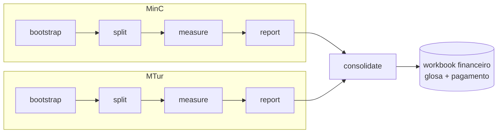

# pyauditor

Pipeline de aferição dos indicadores INMS (SLA) do **contrato 40/2022**, medidos
mensalmente por cada órgão contratante — **MinC** (Ministério da Cultura) e
**MTur** (Ministério do Turismo) — conforme o Anexo D (Prazos e Níveis Mínimos de
Serviço) do Termo de Referência.

A partir de pares declarativos `inms-<nn>.yaml` (config/schema, zero‑padded:
`inms-01.yaml`…`inms-14.yaml`) + `inms-<nn>.csv` (dataset) por indicador e
órgão, `pyauditor`:

1. executa os **14 indicadores** do contrato (INMS 1.1–1.14) através de **quality
   gates** que podem rejeitar linhas do dataset;
2. escreve uma **memória de cálculo** (ROM) Markdown por indicador;
3. consolida tudo em um **Excel de relatório** por órgão, além de uma **capa do
   contrato** (cover sheet);
4. **consolida** ambos os órgãos em um workbook financeiro único (glosa, cálculo
   de pagamento).

O resultado é uma aferição reproduzível, auditable e scriptable de cada
competência mensal do contrato.

Especificação completa: [`docs/spec/inms-pipeline.md`](docs/spec/inms-pipeline.md).
Documentação publicada: <https://joaooliveira92.github.io/pyauditor/>.



`run` encadeia as cinco fases numa única invocação, por órgão. Detalhe camada
por camada (quality gates, resolução de dataset, shapes de cálculo):
[Como o pipeline funciona](portal/concepts/pipeline.md).

---

## Funcionalidades

- **5 shapes de indicador** reduzem o engine a um único fluxo de execução
  (`load config → valida quality_gates → aplica strategy → gera ROM`):
  `ratio`, `segmented_ratio`, `count_difference`, `external_catalog_sum` e
  `precomputed_table` — a configuração canônica usa `ratio`,
  `segmented_ratio` e `precomputed_table`.
- **Strategy/registry pattern**: cada `shape` declara seu próprio modelo Pydantic
  (discriminated union) — `ty` (strict mode) garante que cada strategy
  só recebe o config que sabe processar, sem `dict[str, Any]`.
- **Validação em duas camadas**: Pydantic (config é válida?) vs
  `QualityGateRunner` (os dados batem com as regras de negócio?). O ROM distingue
  "config quebrada" de "dado rejeitado".
- **Multi-órgão** (`MinC`/`MTur`/`both`): cada órgão roda isolado, sem cruzar
  dados; `consolidate` funde-os só ao final.
- **Multi-ativo por indicador**: indicadores por ativo/serviço (ex. INMS 1.14
  File Server, WI-FI) são um dataset único declarado como `precomputed_table` —
  cada linha já traz o resultado calculado daquele item
  (`numerator_column`/`denominator_column`/`name_column`), e o shape soma por
  órgão em vez de exigir um CSV por serviço.
- **Glosa fiscal** (`GLOSAS`): fórmula linear contínua do item 35 do TR
  (`min(30%, Σ Pontos × 0,001%) × valor mensal`) com teto e rollover.
- **Idempotência**: `bootstrap` nunca recria uma capa existente; `run` **retoma**
  de onde parou (etapas `done` não são reprocessadas, exceto
  `report`/`consolidate`, sempre regenerados), com `--force` para reprocessar
  tudo do zero e `--clean` para apagar `roms/`/`reports/` antes de rodar.

---

## Instalação

Requer **Python 3.12+** e [uv](https://docs.astral.sh/uv/).

```bash
uv sync
```

Isso instala o pacote e os grupos de dependências definidos em `pyproject.toml`
(`test`, `quality`, `security`, `docs`).

---

## Uso

### Fluxo interativo

Execute `pyauditor` sem argumentos para um fluxo guiado que percorre toda a
competência (bootstrap → split → measure → report → consolidate), mostra
progresso em vivo e oferece reintentar/omitir/abortar ante falhas. Requer um
terminal real; a entrada por pipe/não-interativa cai em um erro que indica usar
um subcomando diretamente.

### Subcomandos

São separados em passos para que o fiscal técnico possa re‑executar `measure`
conforme chegam novos CSVs sem refazer o mês completo, mais um `run` que encadeia
todos em uma invocação scriptable:

| Comando | Responsabilidade |
|---|---|
| `bootstrap` | cria os CSVs de capa (`capa.csv`, `capa_<órgão>.csv`) e o esqueleto de `input/equipe.csv`; **idempotente** |
| `split <comp>` | valida `categorias.yaml`+CSVs brutos e escreve `sintetico.xlsx` (uma aba por INMS); dentro de `run` roda em modo não-materializado, sem gerar `_split/*` |
| `measure <comp>` | apura os indicadores da competência, gera um ROM por indicador |
| `report <comp>` | consolida os ROMs no Excel de relatório do órgão |
| `consolidate <comp>` | funde os relatórios MinC+MTur no workbook financeiro |
| `run <comp>` | encadeia `bootstrap→split→measure→report→consolidate` |

`bootstrap`, `measure` e `report` aceitam `--orgao {MinC,MTur,both}` (default
`MinC`). Configs canônicos em `configs/_shared/` (14 `inms-0N.yaml` + `datasets.yaml`);
`categorias.yaml` por órgão em `configs/<órgão>/`; dados em
`input/<órgão>/<AAAA>/<MM>`, ROMs em `roms/<órgão>/<competência>/`, e cada
órgão obtém sua própria capa (`capa_<órgão>.csv`) e relatório
(`reports/relatorio_<competência>_<órgão>.xlsx`); `consolidate` funde os dois
em `reports/relatorio_<competência>_consolidado.xlsx`. `measure` filtra
categorias `Grupo_executor` em memória — `input/_split` não é mais
pré-requisito.

```bash
# Cria as capas + esqueleto de equipe de cada órgão (idempotente)
uv run pyauditor bootstrap --orgao both

# Apura cada indicador configurado para uma competência, por órgão
uv run pyauditor measure 2026-06 --orgao both --config-dir configs --data-dir input --output-dir roms

# Consolida os ROMs de cada órgão no seu Excel de relatório
uv run pyauditor report 2026-06 --orgao both --roms-dir roms --output-dir reports

# Funde os relatórios de ambos os órgãos no workbook financeiro do contrato
uv run pyauditor consolidate 2026-06 --report-dir reports --roms-dir roms

# Ou, equivalentemente, encadeia os cinco passos em uma invocação
uv run pyauditor run 2026-06 --orgao both
```

`run` aceita os mesmos flags que os subcomandos individuais (`--config-dir`,
`--data-dir`, `--output-dir`, `--report-dir`, `--capa-path`, `--final-month`,
`--strict`), mais `--force` e `--clean`. Por padrão `run` **retoma** de onde
parou: etapas já persistidas como `done` (de uma tentativa anterior) não são
reprocessadas, exceto `report`/`consolidate`, sempre regenerados a partir dos
ROMs já materializados. `--force` reprocessa tudo desde o zero (ex.: depois de
corrigir manualmente `capa.csv`/`objetos.csv`). `--clean` apaga `--output-dir`
(roms) e `--report-dir` (reports) antes de rodar — combine com `--force` para
também ignorar o estado de retomada salvo em `.pyauditor/runs/`.
`--output {text,json}` controla o resumo final (painel rich vs JSON para
automação). `bootstrap` segue idempotente (nunca recria um arquivo
existente). `split` também pode ser executado isoladamente (`--manifest` aponta
para um `datasets.yaml` alternativo) para materializar `_split/*` (CSVs
filtrados + configs por Categoria) e o `sintetico.xlsx`.

`run` também aceita `--on-warning {continue,pause}` (default `continue`) para
controlar o que fazer quando uma etapa termina com avisos (`in_values` sem
correspondência, linhas não classificadas em `categorias.yaml` etc.):

- `continue` (default): fluxo direto e scriptável, sem pausas — avisos ficam
  só registrados no log e no resumo final, como sempre.
- `pause`: ao final de cada etapa com avisos, a execução para e pergunta como
  seguir — `continuar mesmo assim`, `corrigir e tentar de novo` (dá tempo de
  ajustar `categorias.yaml`, um CSV de entrada etc. e redespacha a mesma
  etapa antes de avançar) ou `abortar` (o estado da etapa já concluída fica
  persistido, retomável numa próxima invocação sem `--force`).

```bash
# Direto, sem pausas (comportamento padrão, ideal para automação/CI)
uv run pyauditor run 2026-06 --orgao both

# Pausa a cada etapa com avisos para revisar/corrigir antes de seguir
uv run pyauditor run 2026-06 --orgao both --on-warning pause
```

### Competência, período e responsáveis automáticos

A capa dos relatórios e ROMs não pede mais hand-fill para campos deriváveis:

- **Competência e Período da aferição** vêm do argumento de competência da CLI
  (`2026-06` → 01/06/2026 a 30/06/2026) e são gravados em ROM, relatório do
  órgão e consolidado.
- **Responsáveis** (fiscal técnico, fiscal requisitante, fiscal administrativo,
  gestor do contrato) têm fonte única em `input/equipe.csv`
  (`FUNÇÃO,NOME,SIAPE`; titulares + linhas `- Substituto`). O `bootstrap` cria o
  esqueleto; ausência ou linha faltante vira `[a preencher]` com warning —
  nunca falha técnica.
- **Filtro pela janela da competência**: cada dataset declara sua coluna de
  período no YAML (`source.period_column`); `split`, `measure` e o
  `sintetico.xlsx` descartam as linhas fora da janela (WARN de janela vazia,
  contagem de descartes no rodapé do ROM). Dataset sem `period_column`
  declarado é falha técnica no pipeline (`measure`/`split`); no sintetico,
  degrada com warning. `--strict` troca a política padrão (linhas sem prova de
  período permanecem para os quality gates decidirem) pelo descarte imediato.

---

## Como funciona: os indicadores por shape

O engine roda um único fluxo (`load config → valida quality_gates → aplica a
strategy → gera ROM`). O registry declara **cinco shapes** (`ratio`,
`segmented_ratio`, `count_difference`, `external_catalog_sum`,
`precomputed_table`); a configuração canônica em `configs/_shared/` usa três:

| Shape | Indicadores | Descrição |
|---|---|---|
| `ratio` | 1.1, 1.3, 1.6, 1.7, 1.11, 1.12 | numerador/denominador × 100, meta com operador (`>=`/`<=`), penalidade em degraus |
| `segmented_ratio` | 1.2 | 3 sub‑razões por categoria (Alta/Média/Baixa), cada uma com meta e taxa própria; penalidade = soma |
| `precomputed_table` | 1.4, 1.5, 1.8, 1.9, 1.10, 1.13, 1.14 | cada linha do dataset já é o resultado calculado de um item; soma numerador/denominador por órgão |

Variações de `ratio`: `count_distinct` (1.1, 1.7, 1.11, 1.12) e `sum` de
colunas (1.3, 1.6). `count_difference` e `external_catalog_sum` seguem
disponíveis no registry para quando a configuração voltar a precisar deles.
Detalhe e justificação contratual em
[`docs/spec/inms-pipeline.md`](docs/spec/inms-pipeline.md#2-classificação-dos-14-indicadores-por-shape).

---

## Estrutura do repositório

```
src/pyauditor/
├── config/            # modelos Pydantic, discriminated union por `shape`, resolução de paths
├── engine/            # backbone de medição (leitura/filtro/janela) + strategies por shape
│   └── strategies/    # ratio, segmented_ratio, count_difference, external_catalog_sum
├── rom/               # ROM Markdown + summary JSON por indicador
├── excel/             # builders de workbook: capa, relatório, sintetico, consolidado
│   ├── sintetico/     # sintetico.xlsx (uma aba por INMS + abas institucionais)
│   └── consolidate/   # CAPA_E_CONTROLE, SERVICOS_POR_ORGAO, INMS_BASE, GLOSAS, CALCULO_PAGAMENTO (+ INMS_BASE_AGRUPADO em excel/inms_grouped.py)
├── orchestration/     # estado do `run` (.pyauditor/runs/), plan, retomada, summary
├── interactive/       # fluxo guiado (TTY)
├── commands/          # contratos neutros de status/resultado por comando
└── cli/               # parser + dispatch: bootstrap / split / measure / report / consolidate / run

configs/_shared/            # 14 inms-0N.yaml + datasets.yaml (single-source)
configs/<órgão>/            # categorias.yaml (por órgão; datasets.yaml fallback)
input/<órgão>/<AAAA>/<MM>   # datasets CSV (git-ignored; contém PII real)
roms/<órgão>/<competência>/ # ROMs .md + summary .json
reports/                    # Excel de relatório por órgão + consolidado
.pyauditor/runs/            # estado de retomada do `run` (git-ignored)
docs/                       # spec, ADR, spreadsheet, styleguide, termo de referência
portal/                     # fonte do site de documentação (zensical)
```

> Os dados de produção estão **fora do versionado** (`input/`, git‑ignored): os
> CSVs de produção levam nome/solicitante/criador/técnico (PII real). As fixtures
> de teste em `tests/fixtures/` são sempre sintéticas ou anonimizadas.

---

## Desenvolvimento

```bash
uv run pytest          # suite completa + cobertura (>85%)
uv run ty check       # strict mode sobre src e tests
uv run ruff check src tests
uv run bandit src      # segurança
uv run pip-audit       # auditoria de dependências
```

`ty` roda em **strict mode** sobre `src` e `tests` (default do ty é mais
estrito que o basedpyright strict; ver `pyproject.toml`). A suite pytest está
configurada com `pytest-cov` (branch coverage, limiar 85%),
`hypothesis` para testes baseados em propriedades, e fixtures sintéticas por
strategy — nunca cópia bruta de CSV de produção.

---

## Documentação

- **Spec**: [`docs/spec/inms-pipeline.md`](docs/spec/inms-pipeline.md) — arquitetura,
  decisões de design e casos de uso.
- **Glossário de domínio**: [`CONTEXT.md`](CONTEXT.md) — órgão, competência, glosa,
  ROM, anistia, decisão fiscal, etc.
- **Estrutura do arquivo**: [`docs/spreadsheet.md`](docs/spreadsheet.md) e
  [`docs/styleguide.md`](docs/styleguide.md).
- **ADR**: [`docs/adr/`](docs/adr/).
- **Documentação**: [zensical](https://docs.astral.sh/zensical/) — `uv run zensical build --clean`.

---

## Licença e autor

Autor: Joao Antonio Oliveira (<joao.oliveira@cultura.gov.br>).