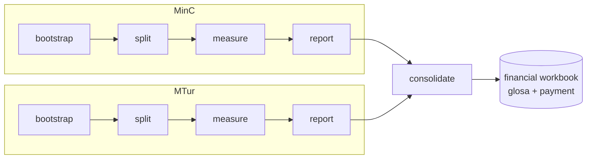

# pyauditor

Audit pipeline for the INMS (SLA) indicators of **contract 40/2022**, measured
monthly by each contracting agency — **MinC** (Ministry of Culture) and
**MTur** (Ministry of Tourism) — per Annex D (Deadlines and Minimum Service
Levels) of the Terms of Reference.

From declarative pairs `inms-<nn>.yaml` (config/schema, zero-padded:
`inms-01.yaml`…`inms-14.yaml`) + `inms-<nn>.csv` (dataset) per indicator and
agency, `pyauditor`:

1. runs the **14 contract indicators** (INMS 1.1–1.14) through **quality
   gates** that can reject dataset rows;
2. writes a Markdown **calculation memorandum** (ROM) per indicator;
3. consolidates everything into a **report Excel** per agency, plus a **contract
   cover sheet**;
4. **consolidates** both agencies into a single financial workbook (glosa,
   payment calculation).

The result is a reproducible, auditable, and scriptable assessment of each
monthly contract period.

Full specification: [`docs/spec/inms-pipeline.md`](docs/spec/inms-pipeline.md).
Published docs: <https://joaooliveira92.github.io/pyauditor/>.



`run` chains the five phases into a single invocation, per agency. Layer-by-layer
detail (quality gates, dataset resolution, calculation shapes):
[How the pipeline works](portal/concepts/pipeline.md).

---

## Features

- **5 indicator shapes** reduce the engine to a single execution flow
  (`load config → validate quality_gates → apply strategy → generate ROM`):
  `ratio`, `segmented_ratio`, `count_difference`, `external_catalog_sum`, and
  `precomputed_table` — the canonical configuration uses `ratio`,
  `segmented_ratio`, and `precomputed_table`.
- **Strategy/registry pattern**: each `shape` declares its own Pydantic model
  (discriminated union) — `ty` (strict mode) ensures each strategy only
  receives the config it knows how to process, without `dict[str, Any]`.
- **Two-layer validation**: Pydantic (is the config valid?) vs
  `QualityGateRunner` (does the data match the business rules?). The ROM
  distinguishes "broken config" from "rejected data".
- **Multi-agency** (`MinC`/`MTur`/`both`): each agency runs in isolation, without
  crossing data; `consolidate` merges them only at the end.
- **Multi-asset per indicator**: indicators per asset/service (e.g., INMS 1.14
  File Server, WI-FI) are a single dataset declared as `precomputed_table` —
  each row already carries the computed result of that item
  (`numerator_column`/`denominator_column`/`name_column`), and the shape sums
  per agency instead of requiring one CSV per service.
- **Fiscal glosa** (`GLOSAS`): continuous linear formula from item 35 of the TR
  (`min(30%, Σ Points × 0.001%) × monthly value`) with cap and rollover.
- **Idempotency**: `bootstrap` never recreates an existing cover sheet; `run`
  **resumes** from where it stopped (`done` stages are not reprocessed, except
  `report`/`consolidate`, always regenerated), with `--force` to reprocess
  everything from scratch and `--clean` to delete `roms/`/`reports/` before running.

---

## Installation

Requires **Python 3.12+** and [uv](https://docs.astral.sh/uv/).

```bash
uv sync
```

This installs the package and the dependency groups defined in `pyproject.toml`
(`test`, `quality`, `security`, `docs`).

---

## Usage

### Interactive flow

Run `pyauditor` without arguments for a guided flow that walks the entire
competence period (bootstrap → split → measure → report → consolidate), shows
live progress, and offers retry/skip/abort on failures. Requires a real
terminal; piped/non-interactive input falls into an error indicating you should
use a subcommand directly.

### Subcommands

They are split into steps so the technical fiscal can re-run `measure` as new
CSVs arrive without redoing the whole month, plus a `run` that chains them all
into a single scriptable invocation:

| Command | Responsibility |
|---|---|
| `bootstrap` | creates the cover CSV files (`capa.csv`, `capa_<agency>.csv`) and the skeleton of `input/equipe.csv`; **idempotent** |
| `split <comp>` | validates `categorias.yaml`+raw CSVs and writes `sintetico.xlsx` (one sheet per INMS); inside `run` runs in non-materialized mode without generating `_split/*` |
| `measure <comp>` | computes the competence indicators, generates one ROM per indicator |
| `report <comp>` | consolidates the ROMs into the agency's report Excel |
| `consolidate <comp>` | merges the MinC+MTur reports into the financial workbook |
| `run <comp>` | chains `bootstrap→split→measure→report→consolidate` |

`bootstrap`, `measure`, and `report` accept `--orgao {MinC,MTur,both}` (default
`MinC`). Canonical configs in `configs/_shared/` (14 `inms-0N.yaml` + `datasets.yaml`);
`categorias.yaml` per agency in `configs/<agency>/`; data in
`input/<agency>/<AAAA>/<MM>`, ROMs in `roms/<agency>/<competence>/`, and each
agency gets its own cover sheet (`capa_<agency>.csv`) and report
(`reports/relatorio_<competence>_<agency>.xlsx`); `consolidate` merges the two
into `reports/relatorio_<competence>_consolidado.xlsx`. `measure` filters
`Grupo_executor` categories in memory — `input/_split` is no longer a
prerequisite.

```bash
# Creates the cover sheets + team skeleton for each agency (idempotent)
uv run pyauditor bootstrap --orgao both

# Measures each configured indicator for a competence period, per agency
uv run pyauditor measure 2026-06 --orgao both --config-dir configs --data-dir input --output-dir roms

# Consolidates each agency's ROMs into its report Excel
uv run pyauditor report 2026-06 --orgao both --roms-dir roms --output-dir reports

# Merges both agencies' reports into the contract's financial workbook
uv run pyauditor consolidate 2026-06 --report-dir reports --roms-dir roms

# Or, equivalently, chains the five steps into a single invocation
uv run pyauditor run 2026-06 --orgao both
```

`run` accepts the same flags as the individual subcommands (`--config-dir`,
`--data-dir`, `--output-dir`, `--report-dir`, `--capa-path`, `--final-month`,
`--strict`), plus `--force` and `--clean`. By default `run` **resumes** where it
left off: stages already persisted as `done` (from a previous attempt) are not
reprocessed, except `report`/`consolidate`, always regenerated from the
already-materialized ROMs. `--force` reprocesses everything from scratch (e.g.,
after manually fixing `capa.csv`/`objetos.csv`). `--clean` deletes `--output-dir`
(roms) and `--report-dir` (reports) before running — combine with `--force` to
also ignore the resume state saved in `.pyauditor/runs/`.
`--output {text,json}` controls the final summary (rich panel vs JSON for
automation). `bootstrap` remains idempotent (never recreates an existing
file). `split` can also be run in isolation (`--manifest` points to an
alternative `datasets.yaml`) to materialize `_split/*` (filtered CSVs + configs
per Category) and the `sintetico.xlsx`.

`run` also accepts `--on-warning {continue,pause}` (default `continue`) to
control what to do when a stage finishes with warnings (`in_values` with no
match, unclassified rows in `categorias.yaml`, etc.):

- `continue` (default): direct and scriptable flow, no pauses — warnings are
  only logged and shown in the final summary, as always.
- `pause`: at the end of each stage with warnings, execution stops and asks how
  to proceed — `continue anyway`, `fix and retry` (gives time to adjust
  `categorias.yaml`, an input CSV, etc., and redispatches the same stage before
  advancing), or `abort` (the completed stage's state stays persisted and can be
  resumed in a later invocation without `--force`).

```bash
# Direct, no pauses (default behavior, ideal for automation/CI)
uv run pyauditor run 2026-06 --orgao both

# Pauses at each warning stage to review/fix before continuing
uv run pyauditor run 2026-06 --orgao both --on-warning pause
```

### Automatic competence period, reporting period, and responsible parties

The report and ROM cover sheets no longer require hand-filling derivable fields:

- **Competence period and reporting period** come from the CLI competence
  argument (`2026-06` → 01/06/2026 to 30/06/2026) and are written to the ROM,
  the agency report, and the consolidated file.
- **Responsible parties** (technical fiscal, requesting fiscal, administrative
  fiscal, contract manager) have a single source in `input/equipe.csv`
  (`FUNCTION,NAME,SIAPE`; incumbents + `- Substitute` rows). `bootstrap` creates
  the skeleton; a missing or incomplete row becomes `[to be filled]` with a
  warning — never a technical failure.
- **Competence window filter**: each dataset declares its period column in the
  YAML (`source.period_column`); `split`, `measure`, and the `sintetico.xlsx`
  discard rows outside the window (WARN on empty window, discard count in the
  ROM footer). A dataset without a declared `period_column` is a technical
  failure in the pipeline (`measure`/`split`); in the sintetico, it degrades
  with a warning. `--strict` swaps the default policy (rows without period
  evidence stay for the quality gates to decide) for immediate discard.

---

## How it works: indicators by shape

The engine runs a single flow (`load config → validate quality_gates → apply
strategy → generate ROM`). The registry declares **five shapes** (`ratio`,
`segmented_ratio`, `count_difference`, `external_catalog_sum`,
`precomputed_table`); the canonical configuration in `configs/_shared/` uses
three:

| Shape | Indicators | Description |
|---|---|---|
| `ratio` | 1.1, 1.3, 1.6, 1.7, 1.11, 1.12 | numerator/denominator × 100, target with operator (`>=`/`<=`), penalty in steps |
| `segmented_ratio` | 1.2 | 3 sub-ratios per category (High/Medium/Low), each with its own target and rate; penalty = sum |
| `precomputed_table` | 1.4, 1.5, 1.8, 1.9, 1.10, 1.13, 1.14 | each dataset row is already the computed result of an item; sums numerator/denominator per agency |

`ratio` variations: `count_distinct` (1.1, 1.7, 1.11, 1.12) and `sum` of
columns (1.3, 1.6). `count_difference` and `external_catalog_sum` remain
available in the registry for when the configuration needs them again. Details
and contractual justification in
[`docs/spec/inms-pipeline.md`](docs/spec/inms-pipeline.md#2-classification-of-the-14-indicators-per-shape).

---

## Repository structure

```
src/pyauditor/
├── config/            # Pydantic models, discriminated union per `shape`, path resolution
├── engine/            # measurement backbone (read/filter/window) + strategies per shape
│   └── strategies/    # ratio, segmented_ratio, count_difference, external_catalog_sum
├── rom/               # Markdown ROM + summary JSON per indicator
├── excel/             # workbook builders: cover sheet, report, sintetico, consolidated
│   ├── sintetico/     # sintetico.xlsx (one sheet per INMS + institutional sheets)
│   └── consolidate/   # CAPA_E_CONTROLE, SERVICOS_POR_ORGAO, INMS_BASE, GLOSAS, CALCULO_PAGAMENTO (+ INMS_BASE_AGRUPADO in excel/inms_grouped.py)
├── orchestration/     # `run` state (.pyauditor/runs/), plan, resume, summary
├── interactive/       # guided flow (TTY)
├── commands/          # neutral status/result contracts per command
└── cli/               # parser + dispatch: bootstrap / split / measure / report / consolidate / run

configs/_shared/       # 14 inms-0N.yaml + datasets.yaml (single-source)
configs/<agency>/      # categorias.yaml (per agency; datasets.yaml fallback)
input/<agency>/<AAAA>/<MM>  # dataset CSVs (git-ignored; contains real PII)
roms/<agency>/<competence>/ # ROMs .md + summary .json
reports/               # per-agency report Excel + consolidated
.pyauditor/runs/       # `run` resume state (git-ignored)
docs/                  # spec, ADR, spreadsheet, styleguide, terms of reference
portal/                # documentation site source (zensical)
```

> Production data lives **outside version control** (`input/`, git-ignored):
> the production CSVs carry name/requester/creator/technician (real PII). The
> test fixtures in `tests/fixtures/` are always synthetic or anonymized.

---

## Development

```bash
uv run pytest          # full suite + coverage (>85%)
uv run ty check       # strict mode over src and tests
uv run ruff check src tests
uv run bandit src      # security
uv run pip-audit       # dependency audit
```

`ty` runs in **strict mode** over `src` and `tests` (ty's default is stricter
than basedpyright strict; see `pyproject.toml`). The pytest suite is configured
with `pytest-cov` (branch coverage, 90% threshold),
`hypothesis` for property-based tests, and synthetic fixtures per
strategy — never a raw copy of production CSV.

---

## Documentation

- **Spec**: [`docs/spec/inms-pipeline.md`](docs/spec/inms-pipeline.md) — architecture,
  design decisions, and use cases.
- **Domain glossary**: [`CONTEXT.md`](CONTEXT.md) — agency, competence, glosa,
  ROM, amnesty, fiscal decision, etc.
- **File structure**: [`docs/spreadsheet.md`](docs/spreadsheet.md) and
  [`docs/styleguide.md`](docs/styleguide.md).
- **ADR**: [`docs/adr/`](docs/adr/).
- **Docs**: [zensical](https://docs.astral.sh/zensical/) — `uv run zensical build --clean`.

---

## License and author

Author: Joao Antonio Oliveira (<joao.oliveira@cultura.gov.br>).