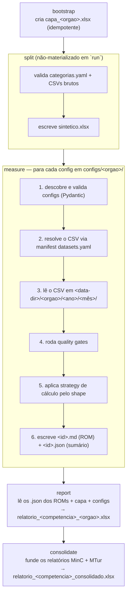

# Como o pipeline funciona

O pipeline apura **uma competência (mês) por vez**, por **um indicador por
config** (`inms-<n>.yaml`). Um único engine atende os 14 indicadores: o campo
`calculation.shape` do YAML seleciona uma *strategy* registrada.

## Visão geral do fluxo

As cinco fases (`bootstrap`, `split`, `measure`, `report`, `consolidate`) rodam
em sequência por órgão (`--orgao MinC|MTur|both`); `consolidate` só roda quando
os dois relatórios existem (com `--orgao both`, ele é a última fase). Dentro do
`run`, `split` roda em modo não-materializado (Ticket 04): não escreve
`_split/*` (CSVs filtrados + configs por Categoria), só o `sintetico.xlsx` —
`measure` filtra `Grupo_executor` em memória. O `run` encadeia as cinco fases
numa única invocação.

Detalhes por camada:

1. **Config e schema (Pydantic).** O `IndicatorConfig` valida o YAML com
   modelos imutáveis e estritos. A validação em duas camadas distingue "config
   quebrada" (erro de schema, fail-rápido) de "dado rejeitado" (filtro de
   business, no passo 4).

2. **Descoberta de arquivos.** `discover_configs` varre
   `<config-dir>/<orgao>/` por `*.yaml`. Arquivos que não têm a chave
   `indicator` (ex.: `datasets.yaml`) são ignorados.

3. **Resolução do dataset.** Cada config referencia o CSV por `source.dataset`
   (um alias no manifesto `configs/<orgao>/datasets.yaml`) ou pelo campo legado
   `source.csv`. O manifesto resolve alias → arquivo + `delimiter` + `encoding`.

4. **Caminho de leitura por competência.** `measure <YYYY-MM>` lê os CSVs de
   `<data-dir>/<orgao>/<YYYY>/<MM>/`, nunca da raiz do `--data-dir` — assim um
   projeto guarda todas as aferições passadas lado a lado.

5. **Quality gates.** O `QualityGateRunner` aplica os `quality_gates.checks`
   declarados no YAML (hoje: `not_null` e `in_set`). Cada linha rejeitada vira
   um `RejectedRow(id, reason)` que alimenta a seção **Rejeições** do ROM. Se
   *todas as linhas existentes* forem rejeitadas, a medição é marcada como
   `hard_failure` (diferente de um CSV vazio de origem, sem linhas).

6. **Estratégia de cálculo.** O `SHAPE_REGISTRY` é um dict módulo-level
   (`shape → strategy`) com import explícito — sem plugin discovery. Cada
   strategy devolve um `CalculationResult` com `result_pct`, `conforms`,
   `penalty_points` e uma `memoria` específica do shape para o renderer do ROM.

7. **Saídas.** O `measure` grava, por indicador, `<sanitized-id>.md` (ROM) e
   `<sanitized-id>.json` (sumário flat via `IndicatorSummary`) em
   `<output-dir>/<orgao>/<competência>/`. O `report` lê **somente os JSONs**
   (não re-parseia o Markdown), junta a capa, os configs (para abas
   `CADASTROS`/`EVIDENCIAS`) e gera `relatorio_<competencia>_<orgao>.xlsx`.
   O `consolidate` funde os dois relatórios em
   `relatorio_<competencia>_consolidado.xlsx` (5 abas — ver
   [Planilha Excel final](../reference/excel.md)).

## Princípios de projeto

- **Validação em duas camadas**: Pydantic (config) e quality gates (dados).
- **Pipeline monólito por shape, não por indicador**: indicadores que não
  divergem estruturalmente compartilham a mesma strategy.
- **Multi-órgão**: `scope.orgao` aceita `MinC` e `MTur`; as pastas são por
  órgão (`configs/<orgao>/`, `input/<orgao>/`, `roms/<orgao>/`) e cada fase roda
  para um órgão de cada vez (`--orgao both` roda os dois em sequência). O
  `consolidate` funde os dois relatórios no workbook consolidado (fórmula
  ponderada — ver [Planilha Excel final](../reference/excel.md)).

## Fontes primárias

- `src/pyauditor/engine/pipeline.py` — orquestração.
- `src/pyauditor/engine/quality_gates.py` — camada de dados.
- `src/pyauditor/engine/strategies/__init__.py` — registry.
- `docs/spec/inms-pipeline.md` §3–§9.